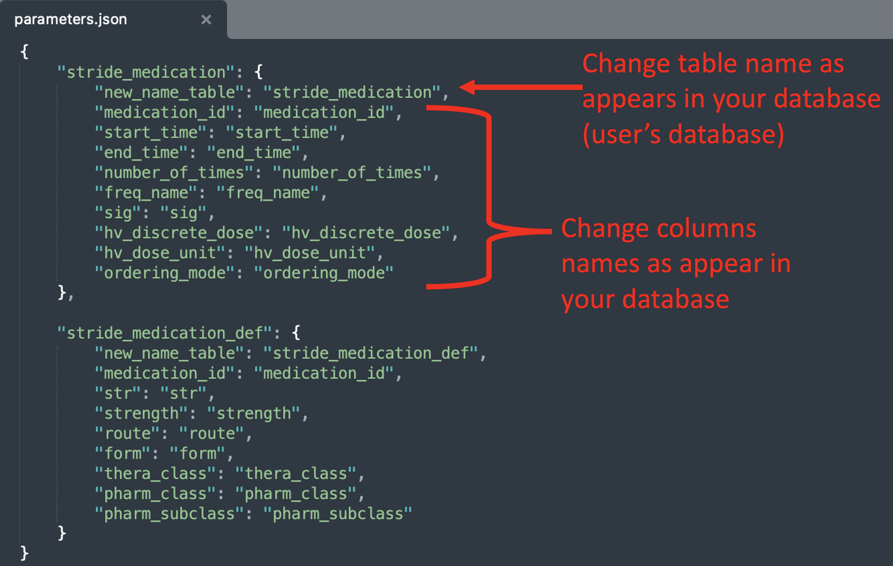

# Opioid2MME (*Temporary Repository*)

## Standardizing Opioid Prescriptions to Morphine Milligram Equivalents from Electronic Health Records

#### Note that this is a temporary repository. Permanent repository is available at [https://code.stanford.edu/boussardlab/mme](https://code.stanford.edu/boussardlab/mme)
##### (*Once all issues are solved in the permanent repository, this temporary repository will be removed*)

 

A) Tables needed
---------------

##### Documentation of code to convert opioid prescriptions to morphine milligram equivalents (MME)
Three important tables are needed to compute MME from opioid prescriptions. We will detail this in the following lines:

1.	**Medication:** this table contains all the prescriptions from the EHR system It’s usually named “stride_medication”. Note that this table contains all type of medications including opioid prescriptions. 

2.	**Medication Definition**: this table contains the list of medications used in the EHR system (old and current medications). It’s usually named “stride_medication_def”.

3.	**Morphine Equivalent**: this table will be CREATED by the user. It will be called “ome_stride_medication_morph_eq_fnl”. It’s not needed to edit its table name and columns’ names. This will contain opioid medications and their associated values of conversion in order to compute the final MME.

For more details of tables' columns, please read the file named [TableInformation.pdf](TableInformation.pdf) 

 

 

[comment]: <> (### B Execution) 
B) Execution
---------------
There are two ways to execute the code to convert opioid prescription to MMEs as described below:

 

**B.1)**	**Default:** if your database presents the same tables' and columns' names, it is not needed to edit the code. You only need to execute by order the SQL files found in the directory "SQL-Default".
  - 1-get_strength
  - 2-get_frequency
  - 3-get_dosage
  - 4-get_mme_factor
  - 5-get_rx_length
  - 6-compute_mme_per_day
  - 7-compute_mme_total
  - 8-morphine-equiv-table
  - 9-conversion-to-MME
  - 10-Additional-NDC_Table

 

**B.2)**	**Edit names**: this table contains the list of medications used in the EHR system (old and current medications). It’s usually named “stride_medication_def”.

